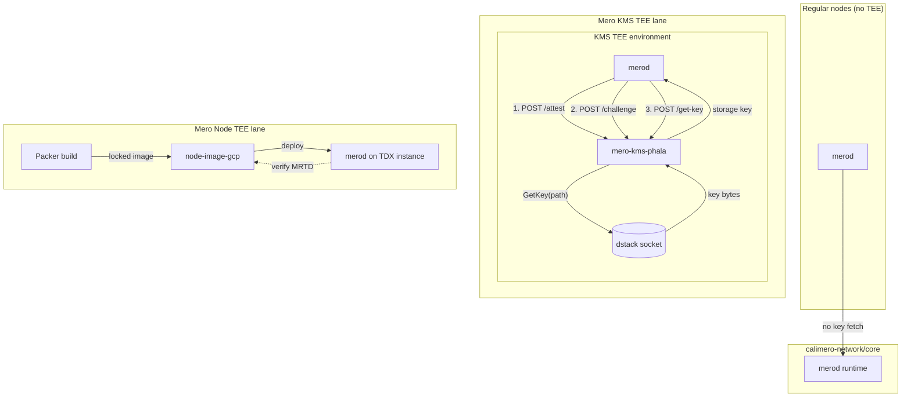
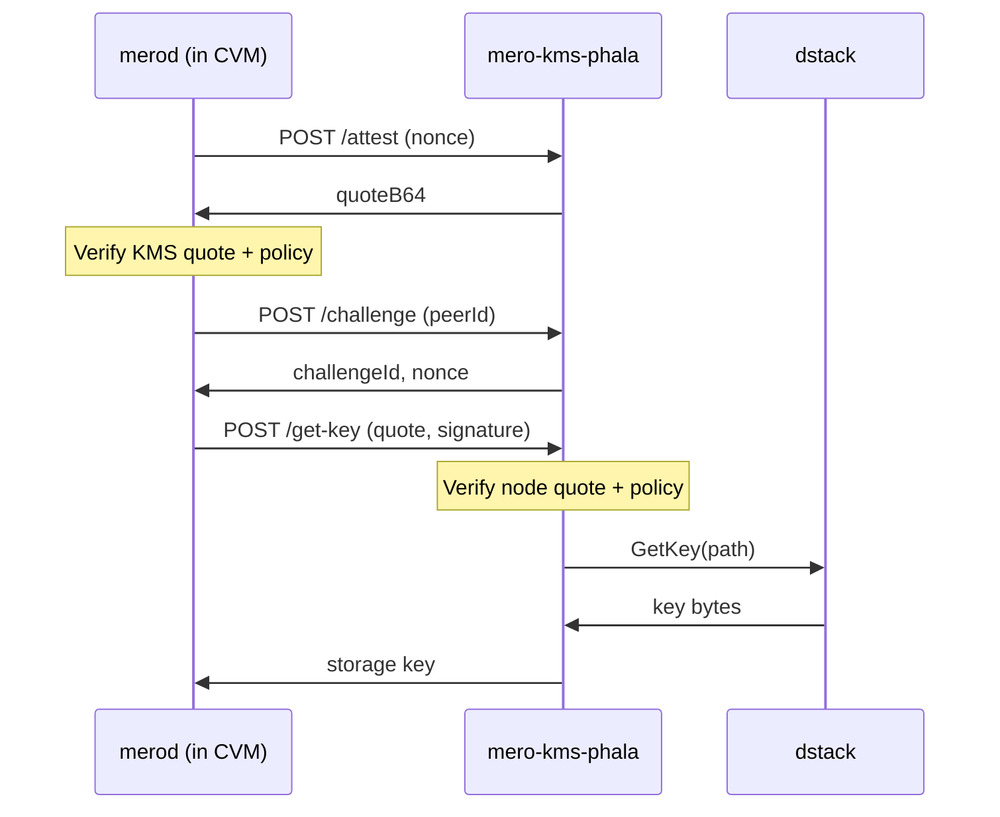

# Architecture Graph

Visual map of KMS, mero-tee, regular nodes, and how they interact.

For the full diagram catalog, see [docs/diagrams/README.md](diagrams/README.md).
Mermaid sources: [`docs/diagrams/src/system-overview.mmd`](diagrams/src/system-overview.mmd), [`docs/diagrams/src/mero-kms-tee-attestation-sequence.mmd`](diagrams/src/mero-kms-tee-attestation-sequence.mmd).

## System overview

## Attestation flow (Mero KMS TEE lane)

## Component roles

| Component | Role |
|-----------|------|
| **merod (regular)** | Node runtime; no TEE, no storage key fetch from KMS |
| **merod (KMS TEE environment)** | Node in TEE; fetches storage keys from KMS after mutual attestation |
| **mero-kms-phala** | Validates merod attestation, enforces policy, releases keys from dstack |
| **dstack** | Key system used by the KMS TEE lane; deterministic key derivation by path |
| **node-image-gcp** | Locked merod images (Packer) for Node TEE instances; MRTD/measurement verification |

## Platform lanes

| Lane | Responsibility |
|------|----------------|
| **Mero KMS TEE** | Deploy mero-kms-phala; merod talks to KMS for key release |
| **Mero Node TEE** | Build/verify/deploy locked merod images; validate measurements |

See [trust-boundaries.md](architecture/trust-boundaries.md) for enforcement points and repository boundaries.
