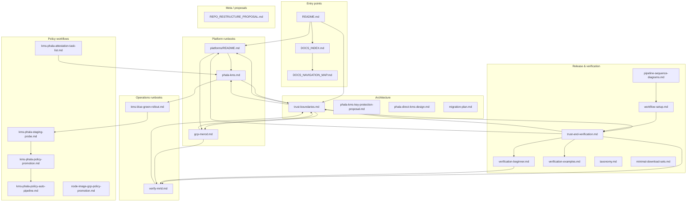

# Documentation Graph

Visual map of mero-tee documentation structure and relationships. Use this to navigate the docs and understand how topics connect.

## Graph

## Legend

| Category | Purpose |
|----------|---------|
| **Entry points** | Repository root and maintainer indexes |
| **Architecture** | Trust boundaries, design proposals, migration plans |
| **Release & verification** | Trust model, verification flows, release taxonomy |
| **Platform runbooks** | Phala KMS vs GCP node-image deployment lanes |
| **Operations runbooks** | MRTD verification, KMS blue/green rollout |
| **Policy workflows** | KMS policy staging, promotion, attestation tasks |
| **Meta** | Repo structure proposals |

## Quick reference by role

| Role | Start here |
|------|------------|
| **Operator** | [trust-and-verification.md](release/trust-and-verification.md) → [platforms/README.md](runbooks/platforms/README.md) |
| **First-time verifier** | [verification-beginner.md](release/verification-beginner.md) |
| **Release engineer** | [pipeline-sequence-diagrams.md](release/pipeline-sequence-diagrams.md) → [workflow-setup.md](release/workflow-setup.md) |
| **Maintainer** | [DOCS_INDEX.md](DOCS_INDEX.md) → [trust-boundaries.md](architecture/trust-boundaries.md) |
