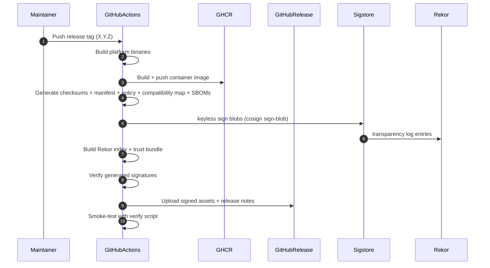
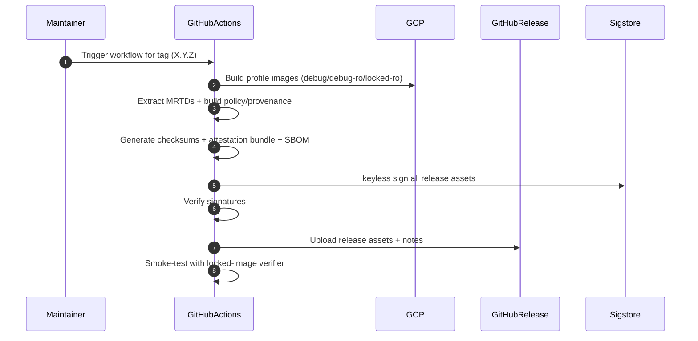
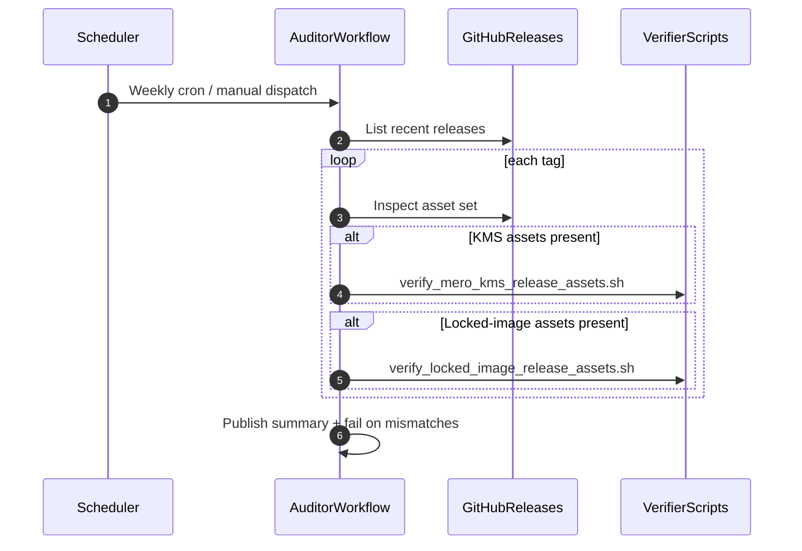

# Release Pipeline Sequence Diagrams

This document visualizes the main release paths and verification loops.

## 1) `release-mero-kms-phala.yaml`

## 2) `gcp_locked_image_build.yaml`

## 3) Scheduled release audit (`release-auditor.yaml`)

