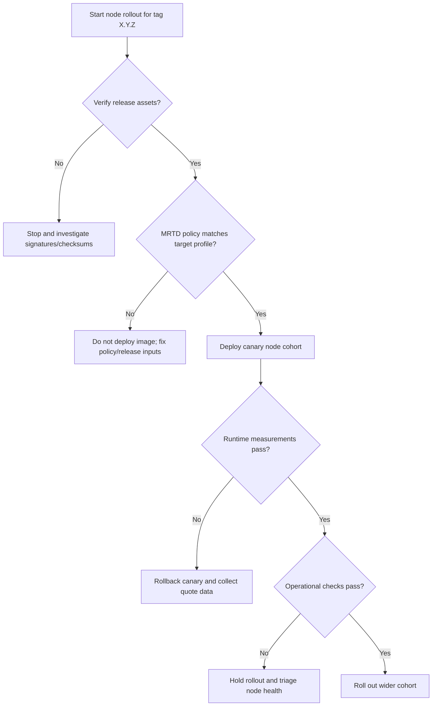
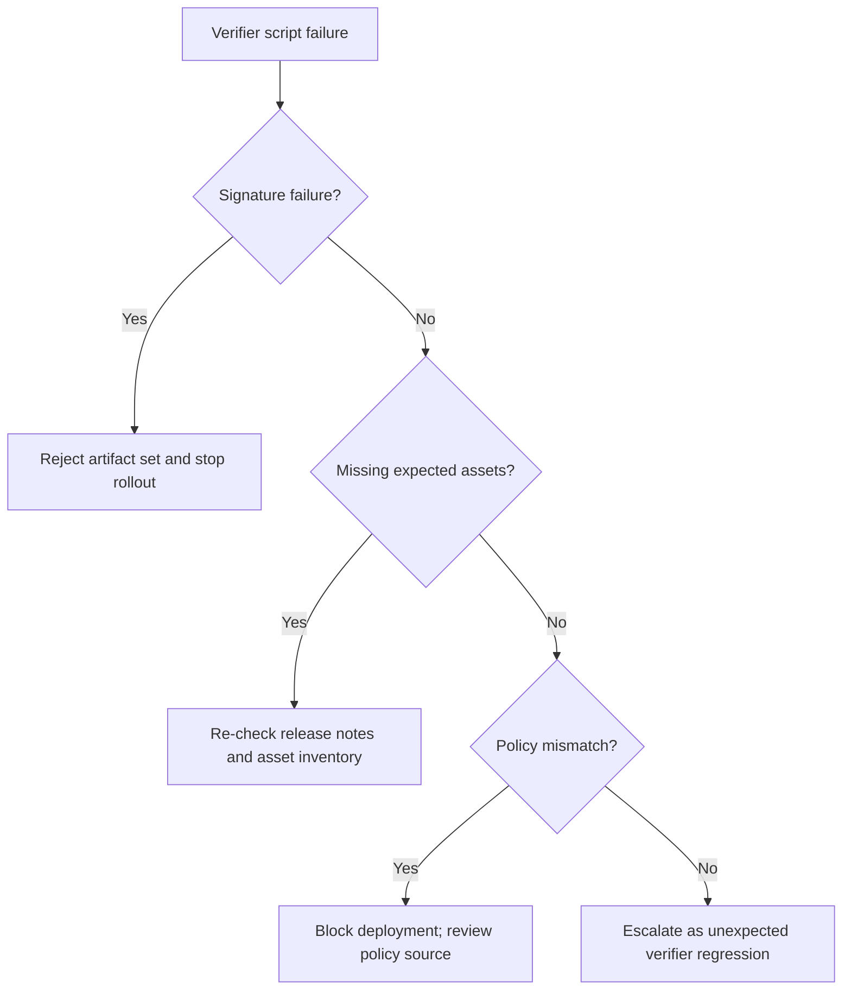

# Operational Decision Flows

Operational flowcharts for rollout and verification decisions.

## GCP node-image verification and rollout

```mermaid
flowchart TD
  A[Start node rollout for tag X.Y.Z] --> B{Verify release assets?}
  B -- No --> B1[Stop and investigate signatures/checksums]
  B -- Yes --> C{MRTD policy matches target profile?}
  C -- No --> C1[Do not deploy image; fix policy/release inputs]
  C -- Yes --> D[Deploy canary node cohort]
  D --> E{Runtime measurements pass?}
  E -- No --> E1[Rollback canary and collect quote data]
  E -- Yes --> F{Operational checks pass?}
  F -- No --> F1[Hold rollout and triage node health]
  F -- Yes --> G[Roll out wider cohort]
```

## Release-asset verification triage

```mermaid
flowchart TD
  R0[Verifier script failure] --> R1{Signature failure?}
  R1 -- Yes --> R1A[Reject artifact set and stop rollout]
  R1 -- No --> R2{Missing expected assets?}
  R2 -- Yes --> R2A[Re-check release notes and asset inventory]
  R2 -- No --> R3{Policy mismatch?}
  R3 -- Yes --> R3A[Block deployment; review policy source]
  R3 -- No --> R4[Escalate as unexpected verifier regression]
```
