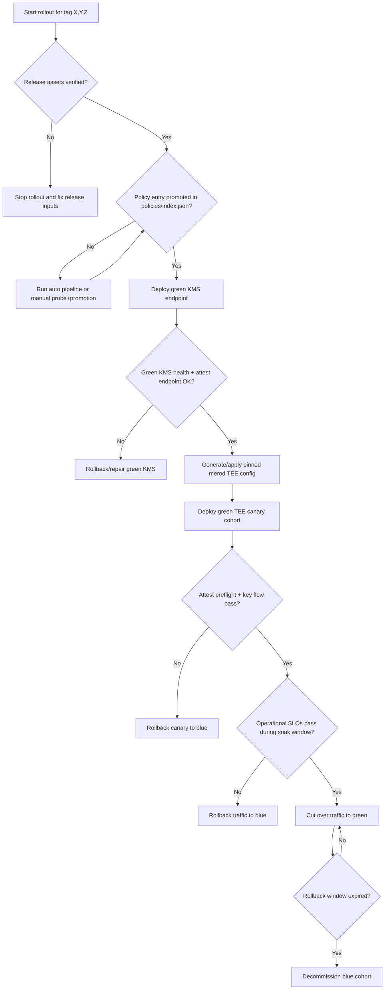

# KMS Blue/Green Rollout Runbook (TEE Nodes)

This runbook defines the production rollout model for KMS-attested TEE nodes.

## Scope

- Applies to **TEE nodes only** (nodes with `[tee]` configured in `core`).
- Non-TEE nodes remain libp2p peers and do not use KMS.

## Goal

Avoid cross-version coupling and circular trust dependencies during upgrades:

- old TEE release nodes talk only to old KMS deployment,
- new TEE release nodes talk only to new KMS deployment.

## Inputs

For a target `mero-tee` tag `X.Y.Z`:

1. `kms-phala-checksums.txt`
2. `kms-phala-release-manifest.json`
3. `kms-phala-attestation-policy.json`
4. Sigstore sidecars for each file (`.sig`, `.pem`)
5. Binary archives and their sidecars

All assets must be verified with:

```bash
scripts/verify-kms-phala-release-assets.sh X.Y.Z
```

## Decision tree



## Decision-node runbook

### D1. Release assets verified?

Required gate:

```bash
scripts/verify-kms-phala-release-assets.sh X.Y.Z
```

- **No**: stop. Do not deploy.
- **Yes**: continue.

### D2. Policy entry promoted?

- Recommended: `kms-phala-policy-auto-pipeline.yaml` handles probe + promotion after version bump merge.
- Manual fallback: run `kms-phala-staging-probe.yaml`, then `kms-phala-policy-promotion-pr.yaml`.
- Gate condition: `policies/kms-phala/<X.Y.Z>.json` exists and `policies/index.json` references it.

### D3. Green KMS healthy?

- Deploy new `mero-kms-phala` to an isolated green environment.
- Use a separate endpoint (for example, `https://kms-green.example.com`).
- Validate health and `/attest` behavior before any TEE node cutover.

### D4. Green TEE config generated and applied?

Generate pinned config from signed release policy:

```bash
scripts/generate-merod-kms-phala-attestation-config.sh X.Y.Z https://kms-green.example.com/ ./tee-kms.toml
```

Or apply directly to an existing node config:

```bash
scripts/apply-merod-kms-phala-attestation-config.sh X.Y.Z https://kms-green.example.com/ /data default
```

### D5. Canary validation pass?

Deploy a small green TEE cohort first, then verify:

- `/attest` preflight succeeds.
- `/challenge` and `/get-key` flow succeeds.
- Cluster health and key-access SLOs remain within bounds.

### D6. Cutover and retirement

- Shift traffic/workload from blue to green only after D5 is stable.
- Keep blue unchanged during rollback window.
- Decommission blue only after stability and rollback windows are complete.

## Rollback branches

Rollback immediately if any gate fails:

- keep blue cohort unchanged,
- route traffic back to blue cohort,
- investigate green release issues out-of-band,
- redeploy green with a newly verified pinned release tag.

## Guardrails

- Never auto-follow `latest` for attestation policy.
- Always pin to a reviewed, signed release tag.
- Fail closed if signature verification or attestation policy verification fails.
